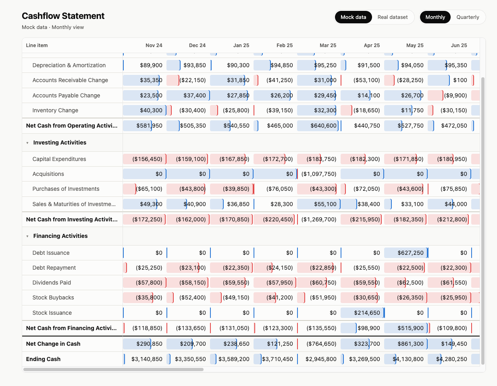
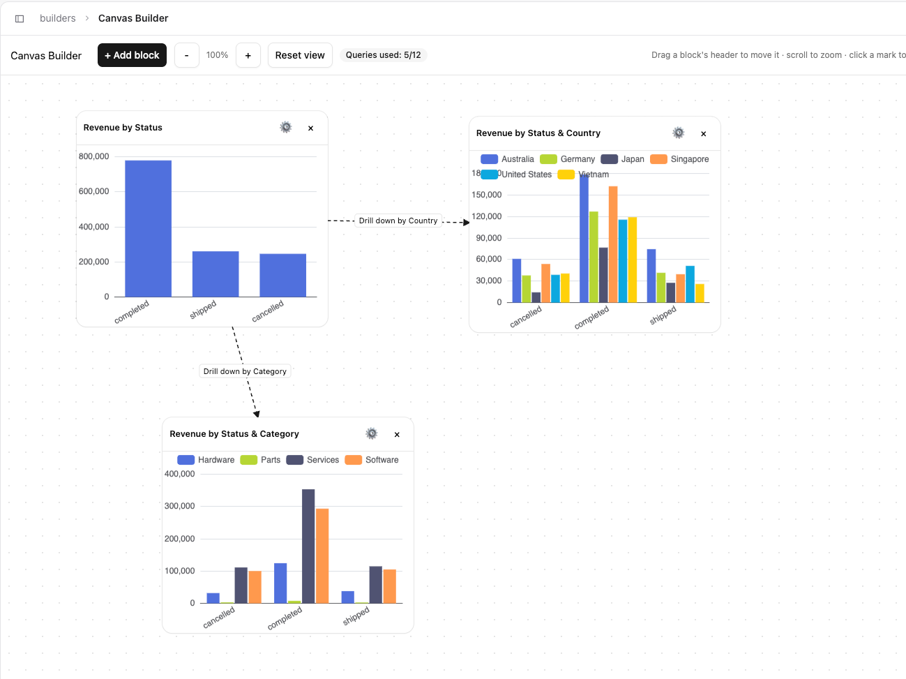

# Anfra

**Anfra is the open source framework for vibe-coding your custom BI application.**

Use your own HTML, JavaScript, and charting library. Anfra connects the app to reusable metrics, live warehouse queries, and analytics interactions such as filtering, drill-down, and period comparisons.

<p align="center">
  <a href="https://docs.anfra.ai">Docs</a> · <a href="https://anfra-demo.pages.holistics.dev/">Live demos</a> · <a href="#quickstart">Quickstart</a>
</p>

<!-- TODO: replace with a GIF of the funnel demo: click a bar, the other charts filter -->
<p align="center">
  <a href="https://anfra-demo.pages.holistics.dev/fancy-demos/funnel-analysis"></a>
</p>
<p align="center">
  <em>A funnel analysis app built by a coding agent with Anfra. <a href="https://anfra-demo.pages.holistics.dev/fancy-demos/funnel-analysis">Try it live →</a></em>
</p>

## Why Anfra?

Traditional BI tools make it easier to trust the numbers, but often limit teams to fixed dashboard layouts and interactions. On the other hand, coding agents can build custom dashboard apps with HTML and JavaScript easily, but wiring each view to the warehouse — and getting filters, drill-downs, and comparisons right — is easy to get wrong and hard to reuse.

With Anfra, you define metrics once, the agent writes the UI, and Anfra turns every click into a query on those metrics. [See what that looks like](#what-it-looks-like).

## Demo gallery

These are custom BI apps (HTML/JS/CSS) generated by coding agents on top of Anfra SDK and Anfra semantic runtime.

| | |
|---|---|
| [](https://anfra-demo.pages.holistics.dev/fancy-demos/funnel-analysis)<br>**[Funnel analysis](https://anfra-demo.pages.holistics.dev/fancy-demos/funnel-analysis)**<br>Add, remove, and reorder funnel steps. Click a bar to see who converted or dropped off. | [](https://anfra-demo.pages.holistics.dev/fancy-demos/cohort-heatmap)<br>**[Cohort analysis](https://anfra-demo.pages.holistics.dev/fancy-demos/cohort-heatmap)**<br>Retention heatmap by signup month. Click a cell to filter, or right-click to see the underlying rows. |
| [](https://anfra-demo.pages.holistics.dev/reports/cashflow)<br>**[Cashflow statement](https://anfra-demo.pages.holistics.dev/reports/cashflow)**<br>Operating, investing, and financing activities with subtotals, monthly or quarterly. | [](https://anfra-demo.pages.holistics.dev/builders/flex)<br>**[Canvas builder](https://anfra-demo.pages.holistics.dev/builders/flex)**<br>Add and arrange charts on a canvas. Click a mark to drill into a linked chart. |

[View more demos →](https://anfra-demo.pages.holistics.dev/)

## How Anfra works

Anfra has three parts:
- **Anfra SDK**: a JavaScript library your app uses to request data and wire up filters, drill-downs, and period comparisons. It asks for data by dataset and metric names, not SQL.
- **Anfra Server** (`anfra serve`): takes each request from the SDK, turns the interaction (a filter, a drill-down, a comparison) into a query on your semantic layer, runs it on the warehouse, and returns the results. It also serves MCP so coding agents can read your models.
- **Semantic layer**: your models, datasets, and metrics, defined as code. Anfra ships with AMQL, the semantic layer behind [Holistics](https://www.holistics.io). Support for other semantic layers is planned.

<p align="center">
  
</p>

How it works in a few steps:
1. Connect Anfra to your warehouse.
2. Define models, datasets, and metrics in AMQL, or have your coding agent draft them for you to review.
3. Ask your coding agent to build an app. It reads the semantic layer and writes HTML and JavaScript that uses the Anfra SDK.
4. Run `anfra serve`. The server resolves each query through the semantic layer, runs it on the warehouse, and returns results to the page.
5. Check any number in the app to see the query and metric definitions behind it.

## What it looks like

A revenue page with two charts: revenue by region and a monthly revenue trend. Clicking a region filters the trend.

<!-- TODO: verify the AMQL metric, the `grain` field, and the generated SQL against the real implementation -->

**1. Define a metric once** in the semantic layer:

```text
Dataset sales {
  metric revenue {
    definition: @aql sum(orders.amount) ;;
  }
}
```

**2. Your agent writes the page.** It declares two queries and a mapping that says a click on one filters the other:

```js
const byRegion = app.createQuery('byRegion', {
  dataset: 'sales',
  dimensions: { region: { field: 'users.region' } },
  measures: { revenue: { field: 'revenue' } },
})
const trend = app.createQuery('trend', {
  dataset: 'sales',
  dimensions: { month: { field: 'orders.created_at', grain: 'month' } },
  measures: { revenue: { field: 'revenue' } },
})

app.mapCrossFilter(byRegion, trend)

regionChart.on('click', (row) => {
  byRegion.select([row])
  app.execute()
})
```

Queries, controls, and mappings like these are what we call Semantic UI. The page declares what each view shows and how views are connected, and Anfra handles the queries.

**3. A user clicks "APAC".** Anfra Server rewrites the trend query and runs:

```sql
SELECT date_trunc('month', orders.created_at) AS month, SUM(orders.amount) AS revenue
FROM orders
JOIN users ON orders.user_id = users.id
WHERE users.region = 'APAC'
GROUP BY 1
```

The page never wrote that SQL, and `revenue` means the same thing in every app that uses it.

**4. Inspect any number** to see the query and metric definitions behind it.

<!-- TODO: add a screenshot or JSON sample of what inspect returns -->

See the [Semantic UI guide](https://docs.anfra.ai/docs/sdk) for queries, controls, and interaction mappings in detail.

## Quickstart

### 1. Install Anfra

```sh
curl -fsSL https://raw.githubusercontent.com/holistics/anfra/main/install.sh | bash
```

The installer downloads the latest release for your platform, places the `anfra` binary in `~/.anfra/bin`, and prints the line to add it to your `PATH`.

Supported platforms: linux (x64/arm64) and macOS (x64/arm64).

You can configure the installer with environment variables:

- `ANFRA_INSTALL_DIR` — install somewhere else (default: `~/.anfra/bin`)
- `ANFRA_VERSION` — install a specific version, e.g. `0.1.0` (default: latest)

To update later:

```sh
anfra update          # replace the binary with the latest release
anfra update --check  # check for a newer release without installing
```

### 2. Create a project

<!-- TODO: `anfra setup` and `anfra init` are not in the CLI yet -->
```sh
anfra setup
anfra init custom-bi
cd custom-bi/
```

Your folder structure should look like this:

<!-- TODO: replace with what `anfra init` actually generates -->
```
custom-bi/
├── .anfra/
│   └── data_sources.yml   # warehouse connections
├── models/                # model definitions (AMQL)
├── datasets/              # dataset definitions (AMQL)
├── apps/                  # one folder per app (HTML + JS)
└── AGENTS.md              # instructions and skills for coding agents
```

### 3. Connect a warehouse

Open `.anfra/data_sources.yml` and fill in your database credentials:

```yaml
# .anfra/data_sources.yml
data_sources:
  warehouse:
    type: postgresql            # TODO: list supported types
    connection:
      host: localhost
      port: 5432
      user: anfra
      password: anfra
      dbname: analytics
```

### 4. Start building

Open the folder in Claude Code or Cursor. `anfra setup` has already registered the skills. <!-- TODO: confirm what `anfra setup` does -->

Then ask the agent for an app:

```text
Look at the orders data and build me a revenue overview: monthly trend,
revenue by region with a region filter, and a table of top products.
Clicking a region should filter everything else.
```

With no models yet, the agent proposes datasets and metrics as code in the `models/` and `datasets/` folders.

Run `anfra serve`. The app opens at `http://localhost:4000/<name>`. <!-- TODO: confirm port and app path -->

## Also works for AI artifacts

Business users already make reports in Claude or ChatGPT. Connect their agents to one Anfra server instead of straight to the warehouse, and the artifacts they create:

- query shared metric definitions rather than improvised SQL;
- keep no data in the file and refresh when opened;
- can be inspected back to the query and metric behind every number.

The open-source server does not manage users or permissions. To share artifacts with permissions, audit them, and revoke access across the company, use [Anfra Cloud](#anfra-oss-vs-anfra-cloud).

## Anfra OSS vs Anfra Cloud

The open-source engine is complete for building, running and self-hosting apps for your team. It is an engine, not the whole car: it doesn't manage users or enforce who can see what.

|                                               | Anfra (open source) | Anfra Cloud |
| --------------------------------------------- | ------------------- | ----------- |
| Semantic layer, metrics, AMQL engine          | ✅                   | ✅           |
| JS SDK, controls, interactions, inspect       | ✅                   | ✅           |
| MCP server + agent skills                     | ✅                   | ✅           |
| Self-host                                     | ✅                   | Managed     |
| Users, SSO, roles                             | —                   | ✅           |
| Row-level and viewer-level permissions        | —                   | ✅           |
| Hosted apps: sharing, public links, discovery | —                   | ✅           |
| Audit trail, usage monitoring                 | —                   | ✅           |
| Snapshots, versioning                         | —                   | ✅           |

## FAQ

<details>
<summary><b>How is this different from giving Claude a warehouse or dbt MCP?</b></summary>

For a one-off question, not much. The difference shows up when you *build*: reusable metrics instead of re-derived SQL, interactions (drill, cross-filter, PoP) resolved by the engine, apps that refresh instead of holding pasted data, and a trace from every number back to its definition.
</details>

<details>
<summary><b>How is this different from Streamlit, Evidence or Hex?</b></summary>

Those give you a framework to write the app in. Anfra gives you a semantic backend for any front end the agent writes: plain HTML/JS, no Python runtime, no fixed component set. Metrics and interactions are defined once and shared across every app.
</details>

<details>
<summary><b>Do I have to learn AMQL?</b></summary>

No. The agent reads and writes it for you, and the skill package teaches it how. You review model changes as code.
</details>

<details>
<summary><b>I already have a BI tool.</b></summary>

Keep it for certified reporting. Use Anfra for the AI-built, exploratory and highly custom apps that don't fit a dashboard grid.
</details>

<details>
<summary><b>Can I use my existing semantic layer (dbt, Cube, Snowflake semantic views)?</b></summary>

Not yet. It's on the roadmap. Direct SQL datasets are supported today. <!-- TODO: confirm what ships in v0.1 -->
</details>

<details>
<summary><b>Is the browser computing any numbers?</b></summary>

Source data is resolved by the server at view time. Page code *can* transform returned rows in JavaScript. Inspect shows the server query, and anything computed on top of it in the page is the page's responsibility.
</details>

## Reference

### Core concepts

| Concept                    | What it is                                                                                                                                             |
| -------------------------- | ------------------------------------------------------------------------------------------------------------------------------------------------------ |
| **Model**                  | A mapping from a warehouse table or SQL query to dimensions and measures, defined in AMQL in `models/`.                                                |
| **Dataset**                | A set of related models the agent is allowed to query, defined in AMQL in `datasets/`.                                                                 |
| **Metric**                 | A named, reusable measure (`revenue`, `active_users`, `conversion_rate`) defined once and composable with others. In AMQL it is written as a `measure`. |
| **Query**                  | A declared request against a dataset: dimensions, measures, filters. Written as AMQL or structured fields; query-local metrics are allowed.            |
| **Control**                | A filter, date drill or parameter whose value flows into the queries it's mapped to.                                                                   |
| **Mapping / cross-filter** | Explicit edges between controls, selections and queries. Nothing cascades implicitly, so behaviour is predictable.                                     |
| **Inspect**                | Every result carries provenance: executed query, fields, metric definitions, timing, cache status and lineage.                                         |

AMQL is the language for defining models and datasets and for querying them.

### CLI

Run `anfra --help` for commands, or `anfra <command> --help` for a specific one.

| Command | What it does |
| --- | --- |
| `anfra serve` | Start a warm server for the current repo. Other commands route to it when it is running. |
| `anfra query` | Compile and run an AMQL query against a dataset (`--generate` prints the SQL, `--validate` type-checks). |
| `anfra validate` | Validate the AMQL repo, optionally scoped to file globs. |
| `anfra ingest` | Build the local search catalog from context sources. |
| `anfra search` | Search the local catalog. |
| `anfra status` | Report whether a warm server is running and its sidecars are healthy. |
| `anfra update` | Update the binary to the latest release. |
| `anfra version` | Print the anfra version. |

### Architecture

| Package | Description |
| --- | --- |
| `core` | The engine: semantic layer, modeling language, query compiler, connections, catalog and lineage. No server, no UI. |
| `server` | HTTP semantic API and MCP server, wrapping `core`. |
| `cli` | `anfra init`, `anfra serve`, `anfra validate` and friends. |
| `sdk` (`@anfra/sdk`) | Headless browser SDK: queries, controls, interactions, state, provenance. |
| `skills` | Agent skills and worked examples for the SDK and modeling language. |

<!-- TODO: confirm repo layout (single repo vs engine + SDK repos — open item with Hoàng). -->

The built-in semantic layer uses AMQL, the language behind [Holistics](https://www.holistics.io), which runs in production at hundreds of companies. Support for other semantic layers is planned. <!-- TODO: verify customer-count claim before publishing -->
