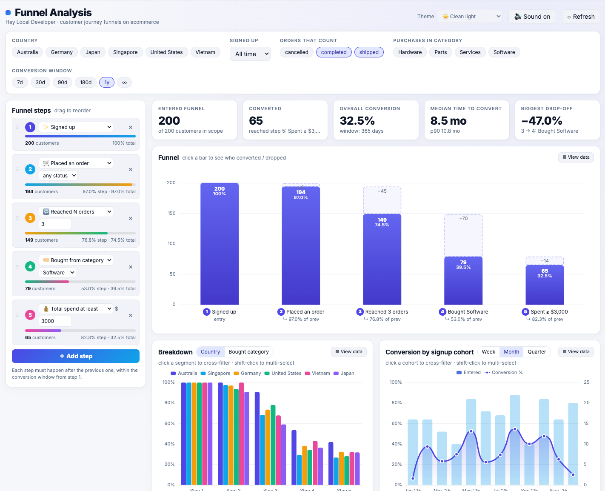
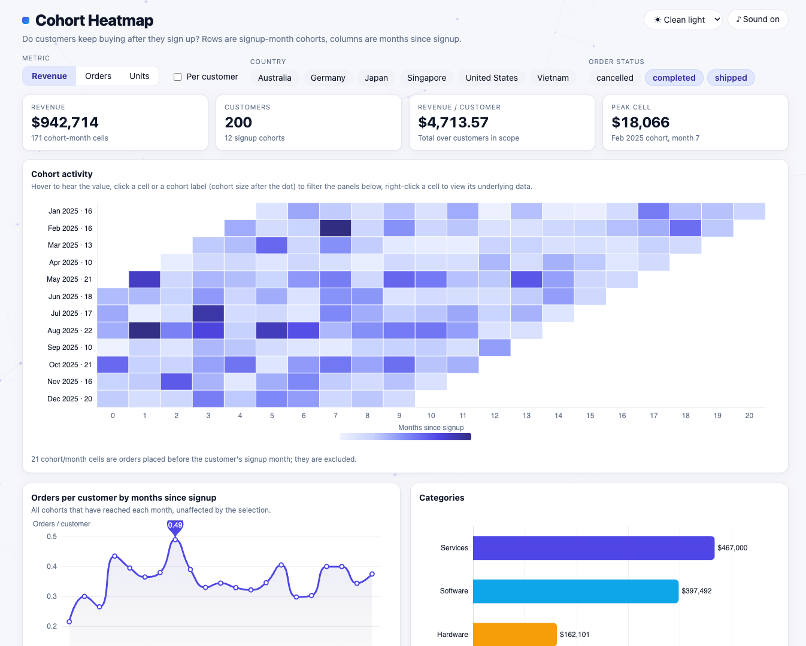
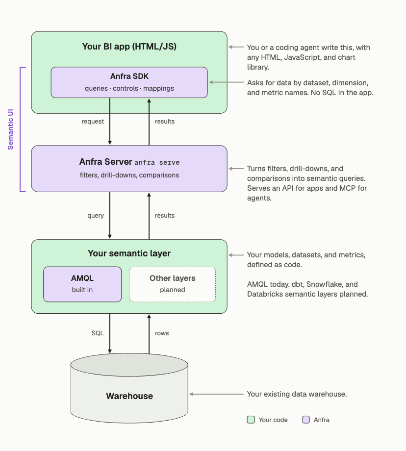

<p align="center">
  <picture>
    <source media="(prefers-color-scheme: dark)" srcset="docs/images/logo-wordmark-dark.svg">
    
  </picture>
</p>

<p align="center"><b>Open-source framework for building trusted custom BI apps</b></p>
<!-- alternatives:
  The open-source framework for turning vibe-coded dashboards into custom BI applications, without sacrificing trust in your data.
  Vibe-code custom BI applications with the freedom of code and the trust of a semantic layer.
-->

<p align="center">
  <a href="https://anfra.ai">Website</a> · <a href="https://docs.anfra.ai">Docs</a> · <a href="https://demo.anfra.ai/">Live demos</a> · <a href="#quickstart">Quickstart</a>
</p>

<p align="center">
  Built by the team behind <a href="https://www.holistics.io">Holistics</a> and <a href="https://dbdiagram.io">dbdiagram.io</a>.
</p>

<!-- TODO: replace with a GIF of the funnel demo: click a bar, the other charts filter -->
<p align="center">
  <a href="https://demo.anfra.ai/apps/fancy-demos/funnel-analysis"></a>
</p>
<p align="center">
  <em>A funnel analysis app built by a coding agent with anfra. <a href="https://demo.anfra.ai/apps/fancy-demos/funnel-analysis">Try it live →</a></em>
</p>

## What is anfra?

Build with AI coding agents using your own HTML, JavaScript, and charting libraries. anfra SDK connects your app to a governed semantic foundation with consistent, reusable metrics and trusted business context.

It also provides powerful analytics interactions: filtering, drill-downs, and period comparisons for your app, out of the box, along with built-in provenance and lineage to help users understand where their data comes from and how metrics are calculated.

## Why anfra?

Traditional BI tools make it easier to trust the numbers, but often limit teams to fixed dashboard layouts and interactions. On the other hand, coding agents can build custom dashboard apps with HTML and JavaScript easily, but wiring each view to the warehouse — and getting filters, drill-downs, and comparisons right — is easy to get wrong and hard to reuse.

With anfra, you define metrics once, the agent writes the UI, and anfra turns every click into a query on those metrics. [See what that looks like](#what-it-looks-like).

## Key features

For **data teams**:

- **Metrics defined once**: models, datasets, and metrics live as code in your repo, and you review changes like any other code.
- **Every number can be inspected**: each value traces back to its query and metric definition.
- **Your warehouse, your infrastructure**: works with PostgreSQL, Snowflake, BigQuery, ClickHouse, and more. Self-host the server, and queries run directly on your warehouse.

For **people building and using apps**:

- **Any layout**: the agent writes plain HTML and JavaScript, with any charting library.
- **Interactions built in**: cross-filters, drill-downs, and period comparisons come from the SDK, not from hand-written SQL.
- **Live data**: apps query the warehouse each time someone opens them, instead of holding pasted numbers.

## Demo gallery

These are custom BI apps (HTML/JS/CSS) generated by coding agents on top of the anfra SDK and server.

| | |
|---|---|
| [](https://demo.anfra.ai/apps/fancy-demos/funnel-analysis)<br>**[Funnel analysis](https://demo.anfra.ai/apps/fancy-demos/funnel-analysis)**<br>Add, remove, and reorder funnel steps. Click a bar to see who converted or dropped off. | [](https://demo.anfra.ai/apps/fancy-demos/cohort-heatmap)<br>**[Cohort analysis](https://demo.anfra.ai/apps/fancy-demos/cohort-heatmap)**<br>Retention heatmap by signup month. Click a cell to filter, or right-click to see the underlying rows. |
| [](https://demo.anfra.ai/apps/reports/cashflow)<br>**[Cashflow statement](https://demo.anfra.ai/apps/reports/cashflow)**<br>Operating, investing, and financing activities with subtotals, monthly or quarterly. | [](https://demo.anfra.ai/apps/builders/flex)<br>**[Canvas builder](https://demo.anfra.ai/apps/builders/flex)**<br>Add and arrange charts on a canvas. Click a mark to drill into a linked chart. |

[View more demos →](https://demo.anfra.ai/)

## Quickstart

### Fastest start: one prompt

Open an empty folder in Claude Code, Codex or Cursor and paste:

```text
Set up anfra (https://github.com/holistics/anfra) in this folder and build a first app on my data.

1. Install the CLI with `curl -fsSL https://anfra.ai/install.sh | bash`. It goes to `~/.anfra/bin/anfra`; use that full path if `anfra` isn't found. Then run `anfra skills install`. If the anfra skills aren't available to you in this session yet, read them from https://github.com/holistics/anfra-skills instead.
2. Run `anfra init` here. Ask me which database to connect, then fill in `.anfra/data_sources.yml` with placeholders for passwords and keys. Let me enter those myself, and don't print them.
3. Look at the tables and pick the few that hold the core business data, such as orders, users or events. Model them with a few metrics in `models/` and `datasets/`, and run `anfra validate` until it passes.
4. Build this app in `apps/`: [describe the app you want, or leave this and suggest one to me before building].
5. Run `anfra serve` and give me the link to the app.
```

The agent stops to ask which database to connect and lets you enter the credentials yourself. Use a read-only database user.

### Or step by step

#### 1. Install anfra

```sh
curl -fsSL https://anfra.ai/install.sh | bash
```

The installer puts `anfra` in `~/.anfra/bin` and adds it to your `PATH`. Works on macOS and Linux; see [Installation](https://docs.anfra.ai/docs/self-hosted/installation) for other options.

Open a new terminal, then install the skills that teach your coding agent to build with anfra:

```sh
anfra skills install
```

This installs them into Claude Code and Codex; add `--agent cursor` for Cursor. For other agents, run `npx skills add holistics/anfra-skills`.

#### 2. Create a project and connect a warehouse

```sh
anfra init my-project
cd my-project
```

This creates the `models/`, `datasets/`, and `apps/` folders and a `.anfra/data_sources.yml` config file, which is added to `.gitignore` so your credentials stay out of Git.

Replace the placeholders in `.anfra/data_sources.yml` with your warehouse credentials. See [Data sources](https://docs.anfra.ai/docs/self-hosted/data-sources) for Snowflake, BigQuery, ClickHouse and the others.

#### 3. Ask your agent for an app

Open the project in your coding agent and ask for an app:

> Use the build-data-app skill. Look at my orders data and build a revenue overview: monthly trend and revenue by region. Clicking a region should filter the trend.

With no models yet, the agent defines the datasets and metrics it needs as code in `models/` and `datasets/`, then builds the app in `apps/`.

#### 4. Run the server

```sh
anfra serve
```

Open http://127.0.0.1:7878/ to see your apps. An app saved as `apps/revenue.html` opens at `/apps/revenue` and reloads as you or the agent edit it.

## Run with Docker

To run a project on a server, or without installing anything, use the image. Mount the project at `/repo`:

```sh
docker run -p 7878:7878 -v "$PWD:/repo" ghcr.io/holistics/anfra
```

The same apps, API and MCP are then at `http://localhost:7878/`. Other commands run the same way, for example `docker run --rm -v "$PWD:/repo" ghcr.io/holistics/anfra validate`.

There is one image for every machine: Docker pulls the build for yours (x64 or ARM, Apple silicon included). Tags follow the releases: `0.4.0`, `0.4`, or `latest`. The server has no login, so publish its port only to people who may query the project's data.

## How anfra works

anfra sits between your app and your semantic layer. It isn't a semantic layer itself: the SDK runs in your page, and the server turns each click into a query on the metrics your semantic layer defines.

- **anfra SDK**: a JavaScript library your app uses to request data and wire up filters, drill-downs, and period comparisons. It asks for data by dataset and metric names, not SQL.
- **anfra Server** (`anfra serve`): serves your apps, takes each request from the SDK, turns the interaction (a filter, a drill-down, a comparison) into a query on your semantic layer, runs it on the warehouse, and returns the results. It also serves MCP so coding agents can read your models.

anfra runs on **your semantic layer**: your models, datasets, and metrics, defined as code. anfra ships with [AMQL](https://amql.org) built in. Support for external semantic layers such as dbt, Cube, Snowflake and Databricks is planned ([details](#faq)).

<p align="center">
  
</p>

## What it looks like

A revenue page with two charts: revenue by region and a monthly trend. Clicking a region filters the trend.

**1. Define a metric once** in the semantic layer:

```text
Dataset sales {
  metric revenue {
    label: 'Revenue'
    type: 'number'
    definition: @aql sum(orders.amount) ;;
  }
}
```

**2. Your agent writes the page.** It asks for `revenue` by name and says that a click on one chart filters the other:

```js
const byRegion = app.createQuery('byRegion', {
  dataset: 'sales',
  aql: `explore { dimensions { region: users.region } measures { revenue: revenue } }`,
})
const trend = app.createQuery('trend', {
  dataset: 'sales',
  aql: `explore { dimensions { month: date_trunc(orders.created_at, 'month') } measures { revenue: revenue } }`,
})
app.mapCrossFilter(byRegion, trend)
```

**3. A user clicks "APAC".** anfra Server adds the filter to the trend query and runs this SQL (PostgreSQL, with time zone handling trimmed):

```sql
SELECT
  DATE_TRUNC('month', "orders"."created_at") AS "month",
  SUM("orders"."amount") AS "revenue"
FROM
  orders "orders"
  LEFT JOIN users "users" ON "orders"."user_id" = "users"."id"
WHERE
  "users"."region" = 'APAC'
GROUP BY
  1
```

The page never wrote that SQL, and `revenue` means the same thing in every app that uses it. See the [Semantic UI guide](https://docs.anfra.ai/docs/sdk) for queries, controls, and interaction mappings.

## anfra OSS vs anfra Cloud

anfra Cloud is our hosted product, built on the same open-source engine. It adds what a team needs to share apps: users and SSO, row-level permissions, hosted apps with sharing links, audit logs and version history.

A project you build with open-source anfra runs unchanged on anfra Cloud. Moving it takes one publish step, with no changes to your models or apps. <!-- TODO: name the command (`git push` or `anfra publish`) once it exists -->

- **Use open-source anfra** to build and run apps on your own infrastructure, for yourself or a team that doesn't need per-user permissions.
- **Use anfra Cloud** to share apps across your company with logins, permissions and audit logs, without running the server yourself.

|                                               | anfra (open source) | anfra Cloud |
| --------------------------------------------- | ------------------- | ----------- |
| Built-in semantic layer (AMQL)                | ✅                   | ✅           |
| JS SDK, controls, interactions, inspect       | ✅                   | ✅           |
| MCP server + agent skills                     | ✅                   | ✅           |
| Self-host                                     | ✅                   | Managed     |
| Users, SSO, roles                             | —                   | ✅           |
| Row-level and viewer-level permissions        | —                   | ✅           |
| Hosted apps: sharing, public links, discovery | —                   | ✅           |
| Audit trail, usage monitoring                 | —                   | ✅           |
| Snapshots, versioning                         | —                   | ✅           |

anfra Cloud isn't available yet. Join the waitlist to get access when it opens. A paid self-hosted edition with the same features is planned. <!-- TODO: link the waitlist -->

## FAQ

<details>
<summary><b>How is this different from connecting Claude to my warehouse, or a BigQuery, Metabase or dbt MCP?</b></summary>

For a one-off question, not much. The difference shows up when you build apps: metrics defined once instead of re-derived SQL in every app, interactions like drill-down, cross-filter, funnels and period comparisons resolved by the engine, apps that query live data instead of holding pasted numbers, and the query and metric behind each number.
</details>

<details>
<summary><b>How is this different from Streamlit, Evidence or Hex?</b></summary>

Those give you a framework to write the app in. anfra gives you a semantic backend for any front end the agent writes: plain HTML/JS, no Python runtime, no fixed component set. Metrics and interactions are defined once and shared across every app.
</details>

<details>
<summary><b>I already have a BI tool. Why would I switch?</b></summary>

anfra is built to replace dashboard BI tools, not to sit beside them. Those tools were designed for building reports by hand in a fixed grid of charts and filters. With a coding agent, your team can build the app they actually need, and anfra keeps it governed: metrics are defined once in the semantic layer, and every number can be inspected back to its query and definition. anfra Cloud adds users, permissions and sharing.

Compared with a traditional BI tool, anfra gives you:
- any layout and interaction your team can describe, instead of a fixed set of chart types;
- a semantic layer that handles funnels, cohorts, drill-downs and period comparisons as built-in operations;
- an open-source engine you can self-host for free.

You don't need to switch all at once. Run anfra next to your current tool, rebuild reports in it as you need them, and decide at renewal whether you still need the old subscription.
</details>

<details>
<summary><b>Why build an app instead of asking the chatbot each time?</b></summary>

Asking a chatbot works for a question you ask once. For questions your team asks every week, an app is built once and then just runs: no tokens spent on each repeat question, and everyone who opens it sees the same numbers computed the same way.
</details>

<details>
<summary><b>Do I have to learn AMQL?</b></summary>

No. Your coding agent drafts and edits models using the anfra skills, and you review changes like any other code. AMQL compiles to plain SQL you can read.
</details>

<details>
<summary><b>Can the AI change my metric definitions?</b></summary>

Apps query metrics through the SDK; they don't edit the model. Models are files in your project, so when your coding agent proposes a change to a metric, you review it like any other code change before it takes effect. <!-- TODO: confirm default for AI-generated ad hoc AQL inside apps -->
</details>

<details>
<summary><b>Can I use my existing semantic layer?</b></summary>

Not today. anfra ships with AMQL. We plan to support other semantic layers such as Cube, dbt, Snowflake and Databricks, though advanced interactions like funnels and period comparisons will depend on AMQL.
</details>

<details>
<summary><b>Does my data leave my warehouse? Which AI does anfra use?</b></summary>

Queries run on your warehouse, and the anfra server sends results straight to the page. Apps don't store query results or warehouse credentials by default. anfra doesn't include an AI model: you use your own coding agent, so what the agent can see depends on what you connect it to.
</details>

<details>
<summary><b>How do I control who can see what?</b></summary>

The open-source server has no login or permissions: anyone who can reach it can open its apps. To restrict access, run it behind your own SSO proxy. For per-viewer permissions (the same app showing different numbers to different users), sharing and audit, use [anfra Cloud](#anfra-oss-vs-anfra-cloud).
</details>

<details>
<summary><b>Are the numbers computed in the browser?</b></summary>

Numbers come from queries the server runs on your warehouse. Page code can still transform the returned rows in JavaScript; Inspect shows the server query, so anything computed on top of it is visible as page code, not hidden in a metric.
</details>

<details>
<summary><b>How does anfra relate to Holistics? Will I be locked in?</b></summary>

anfra is built by the team behind Holistics, and AMQL is the semantic layer Holistics runs on. anfra is a separate open-source project, licensed under Apache 2.0, and doesn't need a Holistics account. Your models and apps are plain files in your own repository, and AMQL compiles to SQL you can read.
</details>

## Learn more

- [Concepts](https://docs.anfra.ai/docs/concepts/data-models): models, datasets, dimensions, and metrics
- [Semantic UI](https://docs.anfra.ai/docs/sdk): queries, controls, interaction mappings, and inspect
- [CLI reference](https://docs.anfra.ai/docs/self-hosted/cli)
- [Installation](https://docs.anfra.ai/docs/self-hosted/installation)
- [anfra.ai](https://anfra.ai): product overview

## License

anfra is licensed under the [Apache License 2.0](LICENSE).
