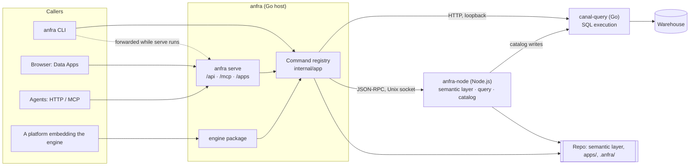

# Architecture

How anfra is put together: the processes, how a command flows through them, the two ways it runs, and where it keeps its state. Why it is shaped this way is in [philosophy.md](philosophy.md).

## Processes

anfra is a Go program (the host) and two sidecar processes it talks to. Each sidecar exists because its work is best done in another runtime, not to split anfra into services: locally, the host starts both and they live and die with it.

| Process | Role | Code |
|---|---|---|
| **anfra** (Go) | The host: commands, the CLI, `anfra serve` (HTTP API, MCP, Data App pages), config and credentials, orchestration, logs. | `cmd/anfra`, `internal/`, `engine/`, `shared/` |
| **anfra-node** (Node.js) | Supplies the host with core functions that exist in Node.js. Today these are mainly the semantic layer's (compiling, validating and showing AML; compiling and validating AQL) and the local catalog's (ingest, search). | holistics-core `apps/anfra-node`; Go client in `internal/sidecar/anfranode` |
| **canal-query** (Go) | Executes SQL against the warehouse, with connection pooling. | holistics/canal; Go client in `internal/sidecar/canalquery` |

The host talks to anfra-node over JSON-RPC on a Unix socket, and to canal-query over HTTP on a loopback port (`internal/sidecar`). anfra-node also reaches canal-query directly when it writes the local catalog (`internal/ingest/ingest.go` passes it canal-query's address).

Only the host reads `.anfra/data_sources.yml`. anfra-node receives each data source's name and type, which it needs for the SQL dialect; the connection, credentials included, goes to canal-query alone, with the query to run (`internal/datasource/datasource.go`).



## How a command runs

Every command, on every surface, goes through the one registry (`internal/app`): the CLI, `anfra serve`'s HTTP ops and MCP tools, and a platform calling `engine.Dispatch`. A query, for example:

1. The input is checked against the command's schema, then its `Check` (rules between arguments), before any sidecar is needed ([commands-and-api.md](commands-and-api.md)).
2. The host asks anfra-node to compile the query for the dataset (AQL, by default). anfra-node reads the repo's semantic layer (its AML), from its compile cache where it can, and answers SQL, or diagnostics saying what is wrong.
3. The host sends the SQL and the data source's connection to canal-query, which runs it on the warehouse.
4. The host shapes the rows into the command's answer. A failure anywhere becomes a classified error ([errors.md](errors.md)).

## Two ways to run

**One-shot CLI.** `anfra query …` starts only the sidecars that command needs (each command declares them, `Needs` in `internal/command/command.go`), runs it, and stops them. Nothing stays behind but logs and caches.

**`anfra serve`.** A long-running server for one repo, with both sidecars kept warm: anfra-node keeps the compiled program in memory, and canal-query pools warehouse connections. It serves the HTTP API, MCP and the Data App pages (`cmd/anfra/serve.go`). It records itself in the repo's runtime file (`serve.json`, under the repo's state folder), and while it runs, CLI commands in that repo find it there and are forwarded to it rather than starting sidecars of their own (`cmd/anfra/runtime.go`, `runCommand` in `cmd/anfra/commands.go`). A second `anfra serve` for the same repo refuses to start.

**Embedded.** A platform imports the `engine` package and calls `Dispatch` in its own process. It runs the sidecars itself, with their own lifecycle and scaling, and connects to them by URL (`engine.Connect`): the engine never spawns processes in a platform's server. See [engine.md](engine.md).

## State and config

Two places, with different owners.

**The repo** holds what its author writes, and is shared through Git:

```
<repo>/
├── .anfra/                    the repo's config: always this name (internal/repo/repo.go)
│   ├── data_sources.yml       warehouse connections, with credentials: git-ignored
│   └── context_sources.yml    what `anfra ingest` indexes for `anfra search`
├── models/, datasets/         the semantic layer (AML by default)
└── apps/                      Data App definitions
```

**anfra's own folder** holds everything anfra keeps on a machine: `~/.anfra`, or `ANFRA_HOME` (`internal/home/home.go`).

```
<ANFRA_HOME>/
├── bin/anfra                  the installer's binary (install.sh)
├── sidecars/<name>-<hash>     embedded sidecars, unpacked to run (internal/sidecar/binary.go)
├── update-check.json          the last update check (internal/update)
└── repos/<repo id>/           one per repo: <folder name>-<hash of its path>
    ├── logs/anfra.log         the host's and sidecars' log
    ├── cache/                 anfra-node's compile cache
    ├── runtime/serve.json     the running server, while there is one
    └── catalog/               the local search catalog
```

Keeping state out of the repo means a repo never fills with generated files, and the same repo checked out twice gets separate state. A unix socket path has a short length limit, so anfra-node's socket goes in the system temp folder instead, named per process (`internal/sidecar/anfranode`).

## Logs and telemetry

**Logs.** The host writes structured JSON records to the repo's `anfra.log`, and forwards each sidecar's stderr into the same file, so one file tells the story of all three processes (`internal/logging`). The terminal stays clean for command output; `ANFRA_LOG_STDERR` also copies the log to stderr. `LOG_LEVEL` sets the level.

**Traces.** When an OTLP endpoint is configured, the host installs OpenTelemetry (`internal/telemetry`). A CLI command is the root of its trace; the op, each call to a sidecar and, under `serve`, the HTTP request are spans under it. The host passes its trace to anfra-node with each call (W3C `traceparent`), and points anfra-node's exporter at the same collector, so one trace runs from the CLI through anfra-node's compile (`cmd/anfra/telemetry.go`). A CLI call forwarded to `serve` carries its trace along, which the server continues when it listens on loopback.

## Further reading

- [philosophy.md](philosophy.md): what core is and where it stops.
- [engine.md](engine.md): embedding anfra in another platform.
- [commands-and-api.md](commands-and-api.md): one definition, every surface.
- [errors.md](errors.md): how errors are classified and shown.
- [data-apps.md](data-apps.md): Data Apps, the SDK and appserve.
- [security.md](security.md): the trust model.
- [sidecars.md](sidecars.md): the sidecars' lifecycle, caches and configuration.
- [release.md](release.md): releases, the Docker image and versions.
