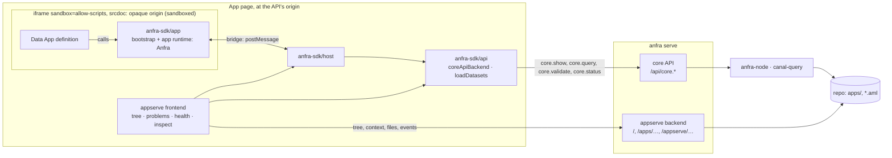

# Data Apps

A **Data App** is an interactive analysis over a repo's datasets: something a reader opens and an author (often an agent) develops. Its **definition** is one HTML file under the repo's `apps/`, which declares its queries (in AQL, today), with controls and cross-filters, and renders their results with its own HTML, CSS and JavaScript. anfra supplies data and state, never UI.

This doc is the design: how a definition becomes a running page, where each concern lives, and the boundaries that keep author code from reaching more than it should. The trust model behind those boundaries is [security.md](security.md); what belongs in core at all is [philosophy.md](philosophy.md).

## Why one HTML file

- **Any UI an author or agent can write.** No component set, no framework to learn: HTML, CSS and JavaScript, with any charting library from a CDN.
- **Nothing to build or deploy.** A file in the repo is a Data App; `anfra serve` shows it, and versioning, review and sharing are the repo's.
- **The SDK is provisioned, not imported.** A definition never mentions the SDK: its host puts the `Anfra` global in place before the definition's first script runs. So a definition carries no version of the SDK, and the same file runs on any platform.

A definition can come from many authors, people and agents, and an agent busy building an analysis may not think of security. So anfra guards every definition for its author: it runs in a sandbox, and reaches data only through the SDK, which offers everything a Data App needs. The safe way is the only way, and also the easy one. Everything below follows from that.

## The pieces

| Piece | Where | What it is |
|---|---|---|
| Data App definition | the repo's `apps/**/*.html` | The author's part: one HTML file that declares its queries, controls and cross-filters through the `Anfra` global, and renders the results with its own HTML, CSS and JavaScript. It runs in the frame. |
| `anfra-sdk/common` | `web/sdk/src/common` | The contract the others share: types (`Backend`, its requests and results, `DatasetDescriptor`, `User`), the error classes, the bridge's messages. No DOM, no network: all of it can end up in a frame. |
| `anfra-sdk/app` | `web/sdk/src/app` | What runs in the frame: the **app runtime** (`createApp`, queries, controls, cross-filters, results, state), given a `Backend` and implementing none, and the **frame bootstrap**, which provisions it from the host and installs `Anfra`. |
| `anfra-sdk/host` | `web/sdk/src/host` | What hosts a Data App, in the page around it: provisions the frame's document, mounts it sandboxed, and answers its calls over the bridge. |
| `anfra-sdk/api` | `web/sdk/src/api` | The core API for the code around a Data App (the page hosting it, scripts, tests): a client generated from `api/openapi.yaml`, `coreApiBackend` (a `Backend` as core ops), `loadDatasets` (what a Data App is provisioned with). |
| appserve backend | `internal/appserve` | `anfra serve`'s Data App routes: the pages, the Data App tree, the files under `apps/`, the reader, live reload. Reaches no data. |
| appserve frontend | `web/appserve` | The page `anfra serve` shows: the tree of Data Apps, the running one in its frame, the repo's problems, the server's health, the inspect panel. Built on `anfra-sdk/host` and `anfra-sdk/api`. |

The SDK is one package with four entrypoints because they are four sides of one contract, released together; its root exports nothing. Its own guide is [`web/sdk/README.md`](../../web/sdk/README.md); the workspace is [`web/README.md`](../../web/README.md).

## The runtime

Opening a Data App:

1. The frontend reads `/appserve/context` (the repo's name, the reader, whether live reload is on) and `/appserve/apps` (the tree, labelled by each definition's `<title>`).
2. It loads the datasets once, with `core.show` of the repo (`loadDatasets`), and the definition from `/appserve/files/<path>`.
3. `mountDataApp` (`host/mount.ts`) creates the frame and serves the bridge *before* the document loads, so no call is missed. The document (`host/provision.ts`) is the definition with three things added at the top of its `<head>`: a `<base href>` at the definition's folder, so its relative URLs (images, scripts next to it) resolve; the provision data (datasets, the reader, the host's origin) as JSON; and the frame script.
4. In the frame, the bootstrap reads the provision data, builds a `Backend` that posts to the host, installs `Anfra`, and the definition runs.
5. Each query, and each filter's suggestions, crosses the bridge; the host answers with `coreApiBackend`, which calls the core API.

The next three sections follow these steps: what a Data App starts with (2 and 3), where it runs and how it reaches out (3 to 5), and what each query carries (5). appserve, which carries out steps 1 to 3 on `anfra serve`, comes after them.

## What a Data App starts with

Steps 2 and 3: before the definition's first script runs, the frame is given everything it needs to describe and query the repo, so a definition never fetches its own setup.

- **Datasets: one `core.show` of the repo.** It answers every dataset in full: models, fields, metrics, as AQL can query them (`internal/command/show`, from anfra-node's `aml.show`). `toDescriptor` maps each to the SDK's `DatasetDescriptor`, named by its fqn. A dataset that can't be shown in full comes in outline with a diagnostic saying why; `loadDatasets` leaves it out rather than failing the rest, and reports the diagnostics, so a Data App that doesn't use it still runs. Diagnostics also report the repo's files that don't compile and a data source the repo doesn't configure.
- **The reader** (`User`): the platform's to say. On `anfra serve` it is the local user, with every permission and the machine's time zone (`internal/appserve/reader.go`). The permissions are rendering hints only; every query is authorised again by whoever answers it.
- **The base URL and the host's origin**, from step 3.

`core.show`'s shape is an object's interface, not its implementation: what a caller needs to write a query or read its result (names, labels, types, roles, AQL definitions), never SQL, tables or data sources. It is read from the compiler today. Moving it onto the semantic catalog, so one part of the system reads the repo's objects, changes where the answer comes from, not what it means.

## Where it runs, and how it reaches out: the frame and the bridge

Steps 3 to 5: the definition runs sandboxed, and the bridge is its one way out.

The frame is `sandbox="allow-scripts"` with its document as `srcdoc`, so it has an **opaque origin**. Its own requests to the API are cross-origin, which `anfra serve` refuses, and carry no credentials on a platform that has them. Storage, forms, popups and navigation are unavailable to it. A definition reaches data only through the bridge.

The bridge (`common/bridge.ts`, served by `host/bridge.ts`) is a small postMessage protocol:

- The frame asks: `anfra:request` with a method and an id, `anfra:cancel`, `anfra:ready`, and inspection snapshots.
- The host answers `anfra:response`, ok or with an error by its SDK class name, and tells the frame whether the inspect panel is open.
- **Only two methods are served: `submitQuery` and `fieldSuggestions`**, the `Backend`'s own. Nothing else of the API is reachable from a frame, whatever the host's credentials.
- Messages are accepted only from that frame's window (an opaque origin can't be checked by name), and the frame posts only to the host's origin, from the provision data.

**`anfra-sdk/app` imports only `common`.** The frame script carries no API client, so a definition can't find one to misuse. `app/bundle.test.ts` builds the frame script as released and checks it. The frame script is built into `host` (a virtual module, `anfra-sdk:frame-script`, answered by a plugin in `web/sdk/tsup.config.ts`), so a host always carries the app runtime it was built with.

## What each query carries: the query and the reader's state

Step 5, in detail: what crosses the bridge and reaches `core.query` for each query.

A query's AQL is fixed when it is declared. What the reader changes (filter values, a cross-filter selection, a sort, a date grain, the page) travels beside it, as the **Query Input**, and `core.query` applies it before compiling (`internal/command/query/input.go`; `app/execution/submitQuery.ts` builds it):

| The reader's state | Becomes |
|---|---|
| A control mapped to a query (`mapControl`) | an entry in `input.filters`, on the mapped field |
| A cross-filter selection | entries in `input.filters`, or one generated condition in `input.conditions` when the selection can't be expressed as ANDed filters |
| `query.setSort` | `input.sorts` |
| A date drill | `input.dateDrills`, on the field the drilled dimensions are built on |
| Paging, the app's time zone | `page`, `page_size`, `timezone` |

So reader input is never spliced into AQL text, and the executed AQL comes back with the result, which is what the inspect panel shows. anfra-node applies the Query Input to the query's `explore { }`, which is why a Data App's queries are explores: controls, cross-filters, sorts and date drills have nothing to apply to in another shape. The Query Input and result columns keep amql's own field names (camelCase), which the SDK speaks too, rather than being converted in core and back in the SDK.

`coreApiBackend` maps the core API's errors to the SDK's classes (`api/errors.ts`): a query anfra refuses or fails is a `QueryError`, a refusal of access a `PermissionError`, an unavailable server a `TransportError`. See [errors.md](errors.md) for the codes.

**Field suggestions** (a filter control's values) are one `core.query` too: a distinct-values explore on the field, sorted and capped, narrowed for a text field by what the reader typed, as a Query Input filter, never spliced. The field must be one of the provisioned dataset's, since it is placed into AQL. It's a formal op used as intended, so a platform authorises it as a query.

## appserve: what `anfra serve` adds

appserve is how `anfra serve` presents Data Apps, in two halves: a backend (`internal/appserve`) that serves the page and what it reads (the tree, the context, the files; steps 1 and 2), and a frontend (`web/appserve`), the page itself, which lists the Data Apps and runs the one a reader opens (steps 1 to 3).

appserve is also the layer to replace. A team building its own platform, or bringing Data Apps into its own app, keeps the SDK and the core API, and swaps appserve for its own pages: its own navigation, its own place to keep Data Apps, its own idea of who the reader is, around `anfra-sdk/host` and `anfra-sdk/api`. anfra-cloud does this: its web app serves Data Apps beside sign-in, organisations and user management, in one richer layer ([what is core's and what is a platform's](#what-is-cores-and-what-is-a-platforms)).

`anfra serve` serves the Data Apps by default (`--no-apps` turns them off), beside the core API on the same listener and origin, so the page needs no CORS (`cmd/anfra/serve.go`). appserve's routes are not ops: they are not in the spec or in discovery, since they are `anfra serve`'s alone.

| Route | Serves |
|---|---|
| `/`, `/apps/<path>` | The frontend's page, the same for every path: the frontend reads the path. `/apps/sales/overview` names `apps/sales/overview.html`. Refuses to be framed (`frame-ancestors 'none'`). |
| `/appserve/assets/…` | The frontend's built files. |
| `/appserve/apps` | The tree of Data App definitions, with their titles. |
| `/appserve/context` | The repo's name, the reader, whether live reload is on. |
| `/appserve/files/<path>` | Any file under `apps/`, as written: confined to `apps/` (through symlinks too), no dot-files. Served with `Content-Security-Policy: sandbox allow-scripts` and `nosniff`, so opening a definition's URL directly never runs it at the API's origin. |
| `/appserve/events` | Live reload's event stream (SSE), when it is on. |

The frontend is built into `internal/appserve/dist` and embedded in the binary; a binary built without it serves a page saying how to build it ([release.md](release.md)). Under `make dev`, `ANFRA_APPSERVE_DEV_URL` makes the pages redirect to Vite's dev server instead, which serves the frontend from source and proxies `/api` and `/appserve` back.

The frontend shows the repo's problems from two sources: `core.validate` (files that don't compile, the validators' errors) and the datasets' diagnostics (a data source not configured, a dataset not shown in full). It polls `core.status` for the server's health, and catches up when the server comes back.

### Live reload

The backend watches `apps/` and the semantic layer (its `.aml` files; skipping dot-directories and `node_modules`), debounces changes, and publishes events: Data Apps changed, with their paths; or the semantic layer changed. The frontend reloads the open Data App when its file changes; on a semantic layer change it reloads the problems and the datasets, then remounts the frame. Nothing is rebuilt on the server: `core.show` and `core.query` read the compile cache, which follows the files.

The watcher runs only while an event stream is open: the first starts it, the last to close stops it, and closing the server ends them all (`internal/appserve/watch.go`). A server only agents and the CLI use watches nothing. `--no-watch` turns it off entirely, for hosting Data Apps for others, where nothing is edited.

## What is core's and what is a platform's

Core (the engine and its ops) knows nothing of Data Apps, pages or readers. It gained only what is right for every client: `core.query`'s Query Input and `core.show`. Everything that maps between the SDK and the core API is `anfra-sdk/api`'s; provisioning and answering the frame is `anfra-sdk/host`'s; where Data Apps live and who reads them is the server's (appserve, on `anfra serve`).

That keeps the browser half portable. Another platform, anfra-cloud included, serves Data Apps with its own page around `anfra-sdk/host` and `anfra-sdk/api`, pointed at its own core API (for example `coreApiBackend('/api/o/{org}')`), and its own server in appserve's place: where the definitions come from, who the reader is, and whether that reader may run each query, see each dataset's schema, or get suggestions. Those are the platform's decisions, made before a core op runs ([engine.md](engine.md)).

Anything a Data App needs that core doesn't formally offer starts in the platform, not in core: a stopgap there is visibly a stopgap, while one in core becomes an implicit contract. A core op is added when no existing op expresses the need completely, with the right permission, as a typed answer. The bar is high because an op, once added, is part of the core API's contract, which every platform serves and a breaking change must declare ([the contract](commands-and-api.md#the-contract-apiopenapiyaml)).
